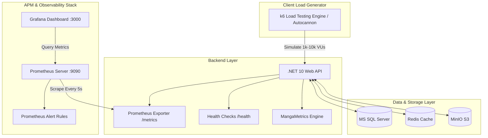

# 📈 Hướng Dẫn Kiểm Thử Chịu Tải & Giám Sát Hệ Thống MangaFlux (Load Testing & APM Monitoring)

Tài liệu hướng dẫn chi tiết quy trình kiểm thử tải mô phỏng **1.000 đến 10.000 người dùng đồng thời (VUs)** và vận hành hệ thống giám sát hiệu năng thời gian thực (**Prometheus + Grafana APM + Health Checks**) cho hệ thống **MangaFlux**.

---

## 📌 1. Kiến Trúc Giám Sát APM & Thu Thập Chỉ Số (Monitoring Architecture)



---

## ⚡ 2. Danh Mục Endpoints Giám Sát & Health Checks

### 2.1. Health Checks Probes
* **Full Diagnostics:** `GET http://localhost:5000/health`
  * Trả về JSON trạng thái chi tiết của từng thành phần (`database`, `redis`, `storage`) kèm độ trễ (latency ms).
  * Mã phản hồi: `200 OK` (Healthy/Degraded), `503 Service Unavailable` (Unhealthy).
* **Liveness Probe:** `GET http://localhost:5000/health/live`
  * Dành cho Kubernetes / Docker Swarm kiểm tra tiến trình API còn sống hay không.
* **Readiness Probe:** `GET http://localhost:5000/health/ready`
  * Kiểm tra xem các kết nối phụ thuộc (Database, Cache) đã sẵn sàng nhận traffic hay chưa.

### 2.2. Prometheus Metrics Endpoint
* **URL:** `GET http://localhost:5000/metrics`
* **Các chỉ số chính thu thập:**
  * `http_requests_received_total`: Tổng số lượt requests theo từng HTTP Method, Route và Status Code.
  * `http_request_duration_seconds`: Histogram thời gian xử lý request (Buckets từ 5ms đến 10s).
  * `mangaflux_cache_hits_total` & `mangaflux_cache_misses_total`: Chỉ số Cache Hit/Miss theo từng prefix key.
  * `mangaflux_chapter_views_incremented_total`: Tốc độ ghi lượt xem vào Redis.
  * `mangaflux_chapter_views_synced_total`: Tổng số lượt xem được worker đồng bộ xuống SQL Server.
  * `mangaflux_db_views_sync_duration_seconds`: Thời gian worker thực hiện batch update SQL Server.
  * `mangaflux_redis_connected`: Trạng thái kết nối Redis (1 = Online, 0 = Offline).
  * `process_working_set_bytes`, `dotnet_total_memory_bytes`, `dotnet_collection_count_total`: Mức chiếm dụng RAM và tần suất thu gom rác GC.

---

## 🚀 3. Hướng Dẫn Khởi Chạy APM Stack (Prometheus + Grafana)

Khởi động toàn bộ cụm Redis, MinIO, Nginx, Prometheus và Grafana qua Docker Compose:

```bash
docker-compose up -d
```

### Truy Cập Dashboard:
* **Grafana APM UI:** `http://localhost:3000` (Tài khoản: `admin` / Mật khẩu: `admin`)
  * Dashboard đã được tự động nạp sẵn: **"MangaFlux APM & System Performance"**.
* **Prometheus UI:** `http://localhost:9090`
  * Xem đồ thị biểu thức PromQL và danh sách cảnh báo tại tab `Alerts`.

---

## 🧪 4. Hướng Dẫn Thực Hiện Kiểm Thử Chịu Tải (Load Testing)

Hệ thống cung cấp sẵn 2 công cụ test: **Autocannon (Node.js)** để benchmark tức thì và **k6** để kiểm thử chịu tải kịch bản sâu.

### 4.1. Chạy Benchmark Tức Thì Bằng Autocannon (Khuyên dùng)
Không cần cài đặt thêm phần mềm rời, chạy trực tiếp trên môi trường Node.js:

```bash
cd loadtests
npm run test:benchmark
```

**Các kịch bản chuyên biệt:**
```bash
# Benchmark chuyên sâu API Đọc Chapter (Redis cache + View counter)
npm run test:chapter

# Benchmark API Trang Chủ (Cache-aside metadata)
npm run test:home
```

---

### 4.2. Chạy Kịch Bản Tải Chuyên Sâu Bằng k6 (1.000 – 10.000 VUs)
Cài đặt k6 (`winget install k6` trên Windows hoặc tải từ [k6.io](https://k6.io)):

```bash
cd loadtests

# 1. Kịch bản tải tổng thể (Homepage + Search + Chapter Read, 5.000 VUs)
k6 run k6-load-test.js

# 2. Kịch bản Stress Test (Leo thang tới 10.000 VUs tìm ngưỡng gãy)
k6 run k6-stress-test.js

# 3. Kịch bản Spike Test (Đột biến 5.000 VUs trong 10 giây)
k6 run k6-spike-test.js
```

---

## 📊 5. Tiêu Chuẩn Hiệu Năng & Xử Lý Sự Cố (SLA & Troubleshooting)

| Chỉ số (KPI) | Mục tiêu SLA (1M Users) | Hành động khi vượt ngưỡng |
| :--- | :--- | :--- |
| **P95 Latency (Chapter/Home)** | `< 100 ms` | Kiểm tra Redis Memory, tăng TTL Cache, rà soát query SQL thiếu Index. |
| **Error Rate (5xx)** | `< 0.1%` | Tăng Connection Pool Size (`Max Pool Size=200` trong chuỗi kết nối SQL Server). |
| **Redis Cache Hit Ratio** | `> 85%` | Mở rộng key cache cho các chapter mới ra mắt hoặc tăng RAM Redis. |
| **CPU API Instance** | `< 70%` | Scale thêm API container (`docker-compose up --scale api=3`). |

---
*Tài liệu hướng dẫn kiểm thử tải và giám sát hệ thống MangaFlux - Hoàn thành 2026.*
